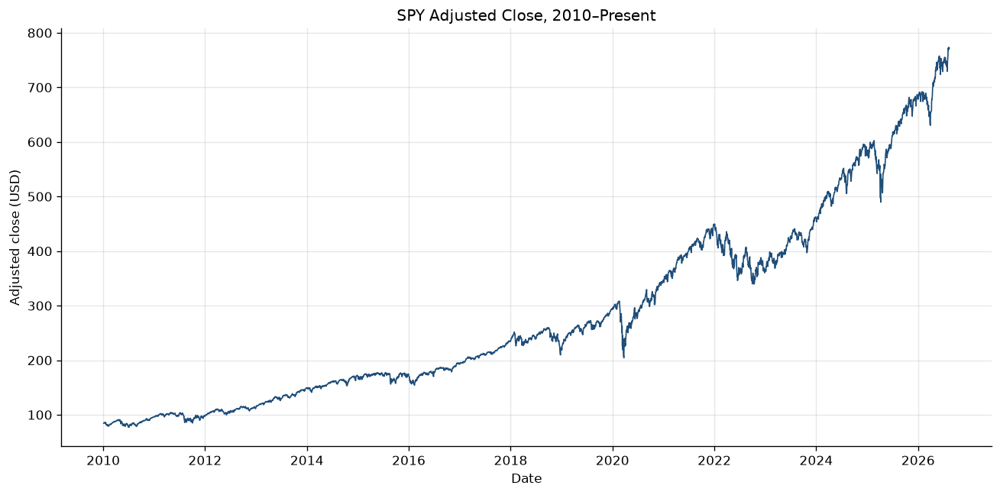
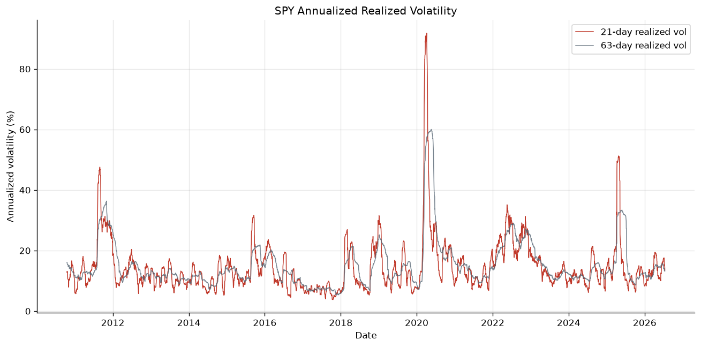
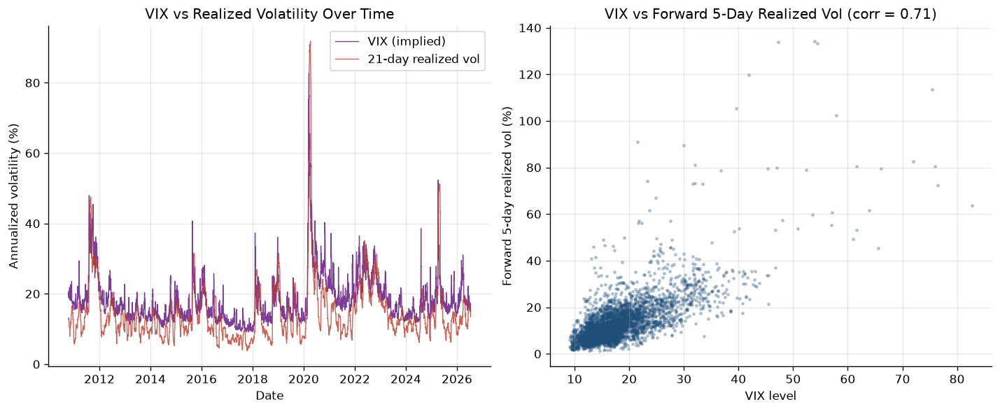
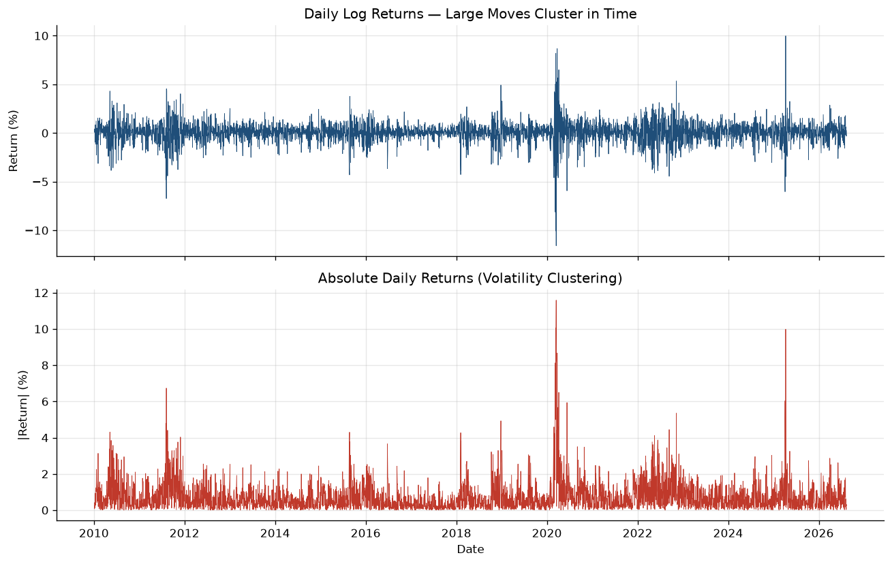
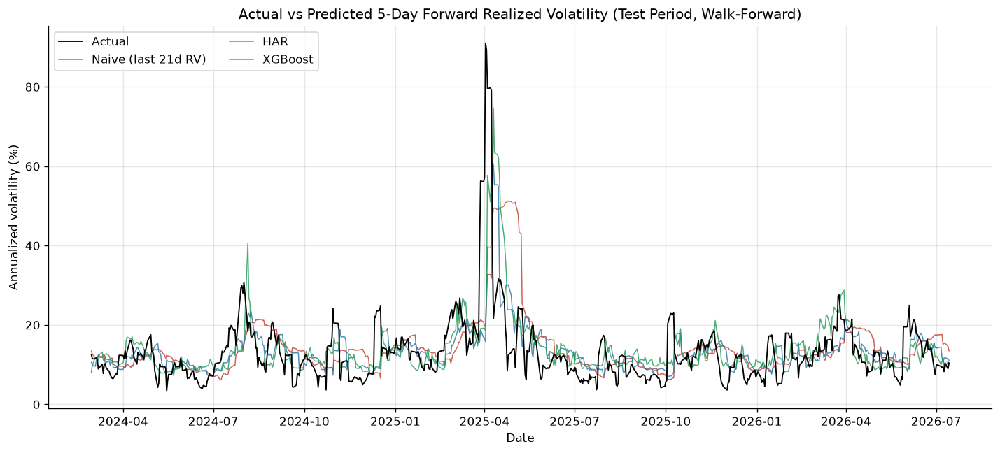
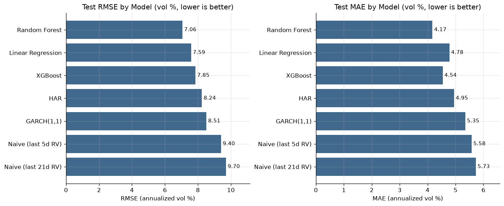
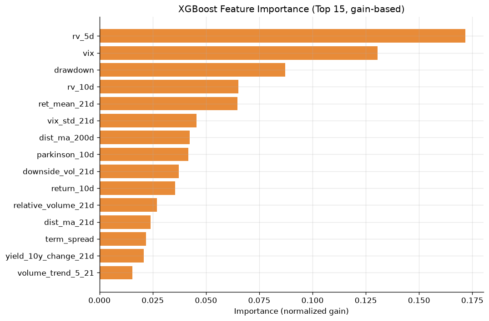
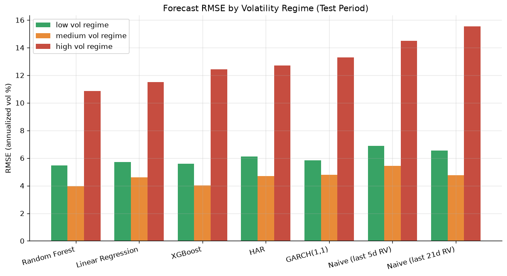

# Equity Volatility Forecasting & Market Regime Research

A quantitative research project investigating whether statistical and
machine-learning models using market, volatility, and macro features can
improve short-horizon realized-volatility forecasts for the S&P 500 (SPY),
relative to simple statistical benchmarks.

All results below are generated by running the pipeline in this repository —
nothing is hand-entered.

## Research Question

> Can historical market, volatility, and macro-related features improve
> short-term (5-day) equity realized-volatility forecasts relative to simple
> persistence benchmarks?

## Why Volatility Matters

Volatility is the central quantity of modern derivatives and risk practice:

- **Options markets** — implied volatility is the price of an option; desks
  compare it against forecasts of realized volatility to find value.
- **Portfolio risk** — VaR, position sizing, and volatility targeting all
  require a forward-looking volatility estimate.
- **Market making** — quote widths and inventory limits scale with expected
  volatility.
- **Risk management** — margin, stress limits, and hedge ratios depend on
  short-horizon volatility forecasts.

This project forecasts volatility only; it does not trade options or
implement a trading strategy.

## Dataset

| | |
|---|---|
| Sources | SPY, ^VIX, ^TNX, ^IRX daily data via Yahoo Finance (`yfinance`), no API keys |
| Raw sample | 4,177 daily observations, 2010-01-04 to 2026-08-12 |
| Model sample | 3,957 observations (2010-10-18 onward, after rolling-window warm-up) |
| Features | 35 engineered predictors, all computable at the close of day *t* |
| Target | 5-day forward realized volatility (10- and 21-day targets also constructed) |

The sample spans several distinct regimes: the post-GFC recovery, the
2015–16 and Q4-2018 corrections, the 2020 COVID crash, the 2022 rate-hike
bear market, and the 2024–2026 test period including the 2025 volatility
spike.

## Methodology

**Target.** Annualized forward realized volatility from daily log returns
\(r_t = \ln(P_t / P_{t-1})\) on adjusted close:

$$RV^{fwd}_{t,h} = \sqrt{\frac{252}{h} \sum_{i=t+1}^{t+h} r_i^2}, \qquad h = 5$$

The window starts at *t+1*, so the target never overlaps information
available at prediction time. Unit tests verify the alignment.

**Features (35).** Trailing realized volatility (5/10/21/63d), Parkinson and
Garman–Klass range-based estimators, returns and momentum (1–63d), rolling
return statistics, distance from moving averages (21/63/200d), VIX level and
dynamics, the VIX-minus-realized-vol spread, drawdown depth and downside
volatility, relative volume, and Treasury-yield features (10y level/change,
term spread — optional; the pipeline runs without them).

**Validation.** Strictly chronological 70/15/15 split
(train 2010-10-18–2021-10-15, validation 2021-10-18–2024-02-28, test
2024-02-29–2026-07-14), then **expanding-window walk-forward evaluation**
over the test period: models are refit roughly quarterly (10 folds of 63
trading days) on all data available at each point. Random K-fold
cross-validation is deliberately avoided — shuffling would train models on
the future of their own test points, which grossly inflates scores for a
persistent series like volatility.

## Models

1. **Naive baselines** — trailing 5-day / 21-day realized vol as the forecast
   (volatility persistence, the benchmark everything must beat)
2. **Linear Regression** — OLS on all 35 standardized features
3. **HAR-style model** — OLS on trailing RV at 5/21/63-day horizons
   (Corsi's heterogeneous-horizon intuition)
4. **XGBoost** — tuned with a small grid (24 combinations) on the
   chronologically separate validation block
5. **Random Forest** — conservative depth, as an ensemble comparison
6. **GARCH(1,1)** — classical econometric benchmark via the `arch` package,
   refit on a rolling basis through the test period

## Results

Test period 2024-02-29 to 2026-07-14 (594 observations, walk-forward).
Units are annualized volatility in decimal (0.01 = 1 vol point).

| Model | MAE | RMSE | R² | QLIKE |
|---|---|---|---|---|
| **Random Forest** | **0.0417** | **0.0706** | **0.411** | **0.359** |
| Linear Regression | 0.0478 | 0.0759 | 0.319 | 0.398 |
| XGBoost | 0.0454 | 0.0785 | 0.272 | 0.374 |
| HAR | 0.0495 | 0.0824 | 0.198 | 0.515 |
| GARCH(1,1) | 0.0535 | 0.0851 | 0.144 | 0.449 |
| Naive (last 5d RV) | 0.0558 | 0.0940 | −0.044 | 0.971 |
| Naive (last 21d RV) | 0.0573 | 0.0970 | −0.111 | 0.599 |

Regenerate with `python run_pipeline.py` — the table is written to
[`reports/model_results.csv`](reports/model_results.csv).

## Key Findings

All findings below are direct restatements of the measured output.

1. **Feature-based models beat naive persistence on this test window.** The
   best model (Random Forest) reduced RMSE by **25%** versus the best naive
   baseline (0.0706 vs 0.0940). The naive baselines posted *negative*
   out-of-sample R² because trailing volatility lags around spikes — it stays
   elevated after the 2025 volatility event had already passed.
2. **Model sophistication adds little beyond features.** Plain OLS on the
   same features (RMSE 0.0759) slightly *beat* tuned XGBoost (0.0785) and
   nearly matched the Random Forest — most predictable variation is linear
   persistence structure that even HAR's three regressors capture much of.
3. **VIX carries genuine incremental information.** VIX has the strongest
   linear correlation with future 5-day realized vol (≈0.71, vs ≈0.66 for
   trailing 5-day RV) and ranks second in XGBoost gain importance —
   consistent with implied volatility embedding forward-looking event risk.
   (Predictive importance, not a causal claim.)
4. **Top XGBoost features:** trailing 5-day realized vol, VIX level,
   drawdown depth, trailing 10-day realized vol, and 21-day mean return.
5. **Forecasting degrades sharply under stress.** Every model's RMSE is
   roughly **2–3× higher in the high-volatility regime** than in the low
   regime (e.g. Random Forest: 0.109 high vs 0.055 low). Volatility forecasts
   are least reliable exactly when they matter most.

## Visualizations

| | |
|---|---|
|  |  |
|  |  |
|  |  |
|  |  |

All ten figures are in [`reports/figures/`](reports/figures/).

## Setup

```bash
git clone <repo-url> equity-volatility-research
cd equity-volatility-research
python3 -m venv .venv && source .venv/bin/activate
pip install -r requirements.txt

# Run everything: download data, train, evaluate, generate figures & tables
python run_pipeline.py

# Optional flags
python run_pipeline.py --refresh    # force re-download of market data
python run_pipeline.py --no-garch   # skip the slower GARCH comparison

# Run the test suite
pytest tests/ -v

# Optional: auto-generate a natural-language brief from the measured results
python generate_research_brief.py   # uses OPENAI_API_KEY if set, else template mode
```

No API keys are required. The optional AI brief generator upgrades to an LLM
narrative only if `OPENAI_API_KEY` is present; the quantitative pipeline is
fully independent of it.

## Project Structure

```
equity-volatility-research/
├── README.md
├── requirements.txt
├── LICENSE
├── run_pipeline.py              # end-to-end research pipeline
├── generate_research_brief.py   # optional AI-assisted results brief
├── RESUME_BULLETS.md
├── INTERVIEW_NOTES.md
├── data/
│   └── README.md                # data sources (raw/processed are gitignored)
├── notebooks/
│   ├── 01_data_exploration.ipynb
│   ├── 02_feature_engineering.ipynb
│   ├── 03_statistical_models.ipynb
│   ├── 04_machine_learning.ipynb
│   └── 05_results_analysis.ipynb
├── src/
│   ├── config.py                # paths, horizons, split fractions, seed
│   ├── data.py                  # yfinance download + caching + merge
│   ├── features.py              # targets & 35 features (leakage-safe)
│   ├── models.py                # naive, OLS, HAR, XGBoost, RF, GARCH
│   ├── evaluation.py            # chronological splits, metrics, regimes
│   └── visualization.py         # all report figures
├── reports/
│   ├── figures/                 # 10 generated charts
│   ├── model_results.csv        # headline comparison table
│   ├── regime_results.csv       # per-regime metrics
│   ├── xgb_feature_importance.csv
│   ├── run_summary.json         # structured run metadata
│   ├── research_brief.md        # auto-generated brief
│   └── research_summary.md      # 1–2 page written summary
└── tests/
    ├── test_features.py         # returns, RV, target alignment, look-ahead
    └── test_evaluation.py       # splits, metrics, regime breakpoints
```

## Data-Leakage Safeguards

- Forward targets are built from returns strictly after *t*
  (`tests/test_features.py::test_forward_target_alignment_uses_only_future_returns`).
- A dedicated test recomputes all features on truncated data and asserts
  values at time *t* are unchanged when the future is removed.
- `StandardScaler` lives inside a pipeline fit on training folds only.
- XGBoost hyperparameters are tuned on the validation block; the test set is
  used exactly once, for final reporting.
- Regime breakpoints are estimated from the training period only.
- Walk-forward folds are strictly expanding — a test asserts training indices
  always precede test indices.
- **Purging:** the last 5 training observations of every fold are dropped,
  because their forward targets are computed from returns inside the test
  window (overlapping-sample leakage). The same purge is applied at the
  train/validation boundary during hyperparameter tuning.
- VIX/macro series are forward-filled only (never back-filled).

## Limitations

- Public **daily** data only — no intraday returns, so the realized-vol
  target and features are noisier than the 5-minute RV used in the HAR
  literature.
- No option-chain or implied-volatility-surface data beyond the VIX index.
- 5-day forward windows overlap, so the effective sample size is smaller
  than the row count and small metric differences are not statistically
  decisive.
- Single test window (2024–2026); relationships are regime-dependent and
  results may not generalize to other periods.
- Limited macro feature set (Treasury-yield proxies only).
- This is a forecasting study, not a trading strategy — no transaction
  costs, execution, or P&L are modeled.

## Future Work

- Intraday (5-minute) realized volatility targets and features.
- Option-chain data: implied-volatility surfaces and the volatility risk
  premium (implied minus subsequent realized).
- Individual-equity volatility and index-vs-single-name dispersion.
- Statistical tests on forecast differences (Diebold–Mariano).
- Deep-learning comparisons (e.g. LSTM) with careful regularization.

## Technologies

Python 3.13 · pandas · NumPy · SciPy · scikit-learn · XGBoost · statsmodels ·
arch (GARCH) · yfinance · Matplotlib · Jupyter · pytest

## License

MIT — see [LICENSE](LICENSE).
